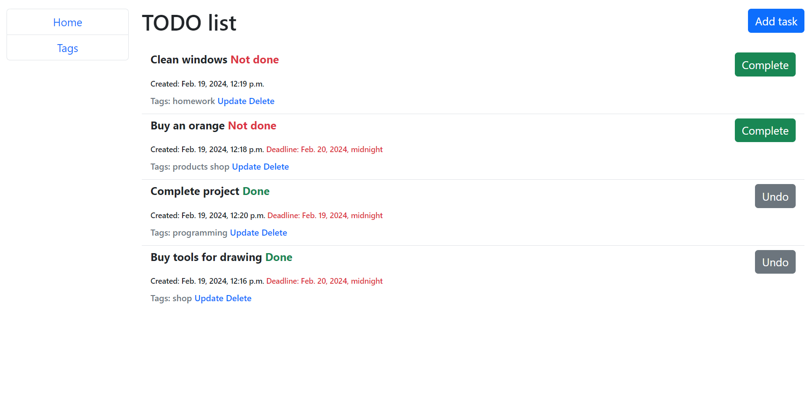

# ToDo List

Simple ToDoList project



Tech stack: [python3](https://www.python.org/downloads/release/python-3100/), [Django4](https://docs.djangoproject.com/en/4.2/), [Bootstrap5](https://getbootstrap.com/docs/5.3/getting-started/introduction/), [crispy-bootstrap5](https://pypi.org/project/crispy-bootstrap5/)

## Installing and settings

You must have installed Python 3.10.0 or above<br>
__(Instructions for Windows)__

1. Installing project:
```commandline
git clone https://github.com/Quiet-Klirik/py-todo-list.git
cd py-todo-list
py -m venv venv
venv/Scripts/activate
pip install -r requirements.txt
```

2. Setting up DB
```commandline
py manage.py migrate
py manage.py loaddata fixture_demo.json
```

3. Start project
```commandline
py manage.py runserver
```
